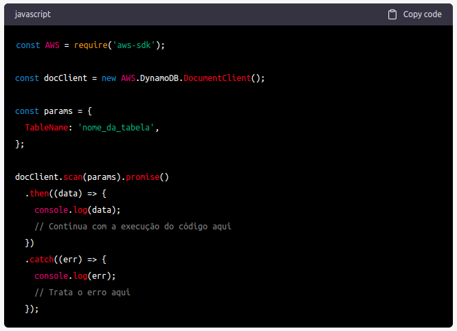

# Como reter a execução do dynamo scan no Node.js até sua conclusão?

Para reter a execução do scan DynamoDB usando o Node.js até que ele seja concluído, você pode usar a função promise() fornecida pelo SDK do AWS para Node.js. A função promise() permite que você trabalhe com as operações do DynamoDB de maneira assíncrona e aguarde até que elas sejam concluídas antes de prosseguir com a execução do código.

Aqui está um exemplo de como usar a função promise() para executar uma operação de scan no DynamoDB e aguardar sua conclusão antes de prosseguir com o código:

No exemplo acima, o scan() é executado no DynamoDB e a função promise() é usada para aguardar sua conclusão. Quando a operação é concluída com sucesso, o resultado é retornado na função then(), e você pode continuar com a execução do código. Se ocorrer um erro durante a operação, ele será retornado na função catch() e você poderá tratá-lo adequadamente.
